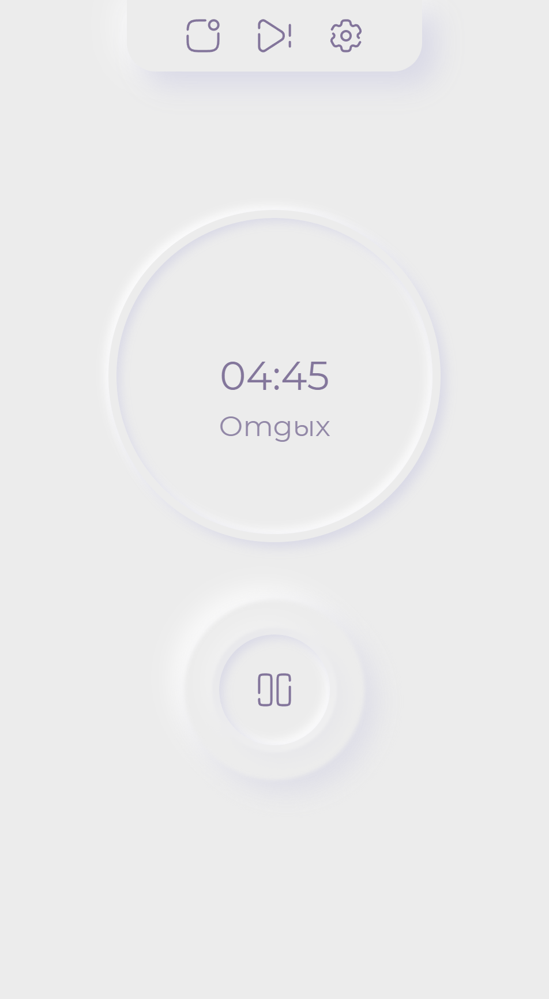

### Помидорчатый таймер 

— это приложение для повышения продуктивности, основанное на технике "Помодоро". Метод помогает эффективно управлять временем, чередуя 25-минутные периоды работы с перерывами.

### Основные особенности

- **Простота использования:** Интуитивно понятный, плавный и минималистичный интерфейс.
- **Возможность настройки:** Возможность устанавливать индивидуальные временные промежутки для работы и перерывов.
- **Звуковые уведомления:** Получение звуковых уведомлений при смене сессий.

### Интерфейс
*Начальное состояние:*

*Таймер запущен:*
  

*Сессия перерыва:*

*Модальное окно с информацией о веб-приложении:*

*Модальное окно настроек:*

Настройки обновляются динамически и сохраняются в LocalStorage для более удобного пользовательского взаимодействия и отсутствия нужды каждый раз устанавливать желаемые параметры заново.
